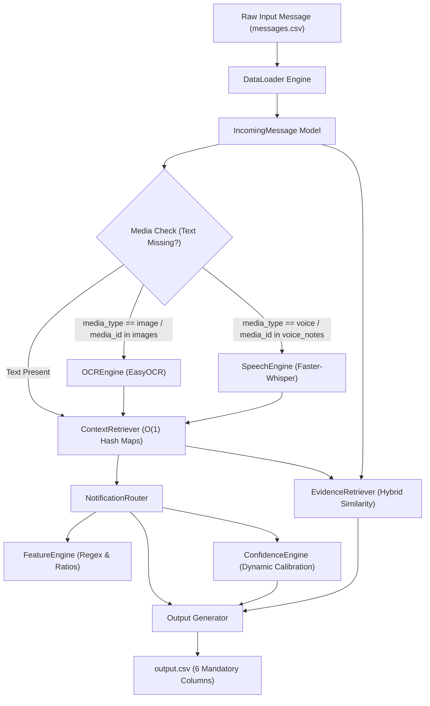

# Intelligent Automated Notification Routing System

[](https://www.python.org/)
[](https://opensource.org/licenses/MIT)
[]()
[]()

An end-to-end, high-performance, multimodal notification routing engine built for intelligent message prioritization across heterogeneous datasets. The system ingests text, image, and voice notifications along with rich contextual metadata across 12 relational tables to deterministically filter, prioritize, and classify messages with dynamic confidence scores and historical evidence references.

---

## 1. Project Overview

### The Problem
Modern mobile users are bombarded by hundreds of notifications daily—ranging from critical bank payment alerts and urgent personal messages to promotional spam and noisy group chat updates. Standard notification delivery systems lack deep context awareness, treating all incoming alerts uniformly. This leads to user cognitive overload, missed high-priority alerts, and unnecessary interruptions during Do-Not-Disturb (DND) windows.

### The Motivation
Building an intelligent notification engine requires balancing immediate message content with historical user interactions, group memberships, subscriber preferences, and multimodal payloads (OCR for text in images, Speech-to-Text for voice notes). The challenge is to deliver a deterministic, sub-second classification engine that guarantees zero information loss, eliminates performance bottlenecks caused by heavy DataFrame iterations, and produces transparent, auditable routing decisions.

### The Solution
The **Intelligent Automated Notification Routing System** provides an end-to-end data processing and inference pipeline. It automatically cleans incoming message attributes, extracts textual content from media attachments using EasyOCR and Faster-Whisper, performs $O(1)$ in-memory context retrieval across 12 relational datasets, evaluates an 11-stage decision hierarchy, computes bounded confidence scores, and retrieves historical evidence references using hybrid similarity.

---

## 2. Features

- ✅ **Personalized Notification Routing:** Deterministically routes incoming alerts into `notify`, `digest`, or `mute` actions based on user behavior and preferences.
- ✅ **Multimodal Processing:** Seamlessly processes text, image payloads, and voice notes.
- ✅ **OCR Text Extraction:** Employs EasyOCR to automatically extract text from image attachments.
- ✅ **Speech-to-Text Transcription:** Employs Faster-Whisper to transcribe audio clips into textual tokens.
- ✅ **Context-Aware Inference:** Evaluates user historical interaction rates (reply, open, dismiss, report), group types, and verified business statuses.
- ✅ **$O(1)$ In-Memory Context Lookup:** Pre-indexes 12 relational CSV tables into dictionary hash maps, eliminating repeated DataFrame filtering loops.
- ✅ **Bounded Confidence Calibration:** Computes dynamic confidence scores mathematically calibrated between `[0.70, 0.95]`.
- ✅ **Hybrid Evidence Retrieval:** Ranks historical message evidence using a weighted combination of RapidFuzz token similarity (60%) and metadata overlap (40%).

---

## 3. High-Level Architecture



---

## 4. End-to-End Execution Pipeline

```
messages.csv
   │
   ▼
DataLoader (Loads 12 CSV Datasets)
   │
   ▼
IncomingMessage (Data Cleaning & Attribute Sanitization)
   │
   ▼
OCR / Speech Engine (EasyOCR / Faster-Whisper Text Extraction)
   │
   ▼
ContextRetriever (O(1) Hash Map Metadata Indexing)
   │
   ▼
FeatureEngine (Regex Keyword Matching & Behavior Ratios)
   │
   ▼
NotificationRouter (11-Stage Priority Rule Hierarchy)
   │
   ▼
ConfidenceEngine (Bounded Dynamic Calibration [0.70, 0.95])
   │
   ▼
EvidenceRetriever (Hybrid Text Similarity + Metadata Scoring)
   │
   ▼
output.csv (6 Mandatory Columns, Zero NaNs)
```

---

## 5. Project Structure

```
hackathon/
├── code/
│   ├── media/
│   │   ├── ocr.py                 # EasyOCR engine wrapper for image text extraction
│   │   └── speech.py              # Faster-Whisper wrapper for audio transcription
│   ├── output/
│   │   └── output.csv             # Generated inference output file
│   ├── config.py                  # Project path configurations and environment setup
│   ├── confidence.py              # Bounded confidence scoring engine
│   ├── context_retriever.py       # O(1) in-memory relational hash map context retriever
│   ├── evidence.py                # Hybrid text similarity & metadata evidence ranker
│   ├── explorer.py                # Dataset exploration & schema inspection utility
│   ├── feature_engine.py          # Feature extraction & DND window validation engine
│   ├── generate_output.py         # End-to-end batch prediction & output generator script
│   ├── loader.py                  # Multi-dataset CSV loader engine (12 relational files)
│   ├── main.py                    # Primary entry point & verification demonstration script
│   ├── models.py                  # Dataclass definitions for IncomingMessage and UserContext
│   ├── router.py                  # 11-stage priority decision rule hierarchy engine
│   └── sample_analyzer.py        # Sample dataset distribution analyzer
├── dataset/                       # 12 Relational CSV datasets and media directories
├── AGENTS.md                      # Agent instructions & development guidelines
├── README.md                      # Project documentation & GitHub showcase
├── output.csv                     # Root predictions file
├── problem_statement.md           # Problem specification & hackathon requirements
└── report.md                      # Production architecture & technical verification report
```

---

## 6. Tech Stack

- **Language:** Python 3.9+
- **Data Processing:** Pandas
- **Text Similarity:** RapidFuzz (Token Sort Ratio)
- **Computer Vision / OCR:** EasyOCR
- **Audio Processing:** Faster-Whisper
- **Pattern Matching:** Python Standard `re` (Regex with word-boundaries `\b`)
- **Diagrams & Documentation:** Mermaid.js, Markdown

---

## 7. Core Components

### 1. DataLoader (`code/loader.py`)
Loads all 12 relational CSV datasets (`messages`, `users`, `groups`, `group_members`, `business_accounts`, `user_business_history`, `message_history`, `message_events`, `images`, `voice_notes`, `daily_notification_summary`, `sample_messages`) into memory during pipeline startup.

### 2. ContextRetriever (`code/context_retriever.py`)
Constructs in-memory hash maps (`dict`) during initialization to enable $O(1)$ constant-time retrieval of user details, group memberships, business subscriptions, historical messages, message events, and daily notification counts.

### 3. FeatureEngine (`code/feature_engine.py`)
Extracts binary keyword flags using regex word boundary patterns (`PAYMENT`, `URGENT`, `PROMOTION`, `EVENT`, `SCAM`), calculates user interaction ratios (`reply_rate`, `open_rate`, `dismiss_rate`, `report_rate`), and validates whether the current message timestamp falls inside the user's Do-Not-Disturb (DND) window.

### 4. NotificationRouter (`code/router.py`)
Evaluates an 11-stage deterministic rule hierarchy to assign an explicit routing `action` (`notify`, `digest`, `mute`), `message_type`, and auditing `reason`.

### 5. ConfidenceEngine (`code/confidence.py`)
Calculates dynamic confidence scores starting from a baseline score of `0.75`, adding or subtracting weighted feature deltas, and bounding the final score to `[0.70, 0.95]`.

### 6. EvidenceRetriever (`code/evidence.py`)
Ranks historical user messages using a hybrid scoring algorithm ($0.6 \times \text{similarity} + 0.4 \times \text{metadata}$), returning up to 3 semicolon-delimited historical message IDs (or `"none"`).

### 7. OCREngine (`code/media/ocr.py`)
Provides an EasyOCR reader wrapper to extract text tokens from image attachments stored in `dataset/media/images/`.

### 8. SpeechEngine (`code/media/speech.py`)
Provides a Faster-Whisper model wrapper to transcribe voice note recordings stored in `dataset/media/audio/`.

### 9. Output Generator (`code/generate_output.py`)
Executes the batch prediction loop across all dataset messages, populates extracted text from media engines, executes context retrieval and routing, and exports results to 6-column CSV files.

---

## 8. Routing Logic Hierarchy

The decision engine evaluates rules in strict sequential order:

```
1. Scam & High Risk Detection
   ├── Condition: Forwarded >= 10 OR Scam keywords OR Report rate >= 20%
   └── Decision: action = MUTE | message_type = scam

2. Verified Bank Payments
   ├── Condition: Business Category == "bank" AND Business Verified AND Payment keywords
   └── Decision: action = NOTIFY | message_type = payment

3. Promotional Content
   ├── Condition: Contains Promotion keywords
   ├── Sub-clause: User allows promotions -> action = DIGEST | message_type = promotion
   └── Default: action = MUTE | message_type = promotion

4. Family Group Messages
   ├── Condition: Group Type == "family"
   └── Decision: action = NOTIFY | message_type = personal

5. School Group Announcements
   ├── Condition: Group Type == "school" AND Event keywords
   └── Decision: action = NOTIFY | message_type = event

6. Work Group Discussions
   ├── Condition: Group Type == "work"
   ├── Sub-clause: Replies sent in 30d >= 5 -> action = NOTIFY | message_type = personal
   └── Default: action = DIGEST | message_type = personal

7. User-Muted Groups
   ├── Condition: Group muted by user preference
   └── Decision: action = MUTE | message_type = unknown

8. Do-Not-Disturb (DND) Window
   ├── Condition: Message time inside DND window AND NOT Urgent AND NOT Payment
   └── Decision: action = DIGEST | message_type = unknown

9. Historical User Reaction
   ├── Condition A: Reply rate >= 40% -> action = NOTIFY | message_type = personal
   └── Condition B: Dismiss rate >= 50% -> action = MUTE | message_type = unknown

10. Urgent Personal Messages
    ├── Condition: Conversation Type == "personal" AND Urgent keywords
    └── Decision: action = NOTIFY | message_type = urgent

11. Default Fallback
    └── Decision: action = DIGEST | message_type = unknown
```

---

## 9. Evidence Retrieval Scoring

The `EvidenceRetriever` computes a weighted hybrid score between the current message and all historical messages belonging to the user:

$$\text{Total Score} = (\text{TextSimilarity} \times 0.6) + (\text{MetadataScore} \times 0.4)$$

### Metadata Score Allocations
- **Sender Match (`sender_user_id`):** +45.0 points
- **Business Match (`business_id`):** +35.0 points
- **Media Type Match (`media_type`):** +25.0 points
- **Group Match (`group_id`):** +20.0 points
- **Conversation Type Match (`conversation_type`):** +15.0 points

Text similarity is computed using `rapidfuzz.fuzz.token_sort_ratio`. Messages with a total score exceeding `40.0` are sorted descending, and the top-3 unique `message_id` values are formatted as a semicolon-separated string (e.g. `message_0101;message_0102;message_0103`). If no candidate meets the threshold, `"none"` is returned.

---

## 10. Confidence Calibration

Confidence is calculated dynamically starting from a baseline score of **0.75**, modified by feature indicators:

| Feature Indicator | Score Adjustment |
| :--- | :---: |
| Verified Business Account | `+0.04` |
| Known Business Subscriber | `+0.03` |
| Payment Keywords Present | `+0.03` |
| Urgent Keywords Present | `+0.03` |
| Event Keywords Present | `+0.02` |
| Scam Keywords Detected | `+0.05` |
| User Report Rate $\ge 20\%$ | `+0.04` |
| User Reply Rate $\ge 40\%$ | `+0.03` |
| User Dismiss Rate $\ge 50\%$ | `+0.03` |
| Unallowed Promotional Message | `+0.02` |
| Non-urgent DND Delivery | `-0.02` |

The final score is strictly constrained using min-max bounding to `[0.70, 0.95]` and rounded to 2 decimal places.

---

## 11. Multimodal Support Integration

The system natively supports multimodal notifications without altering downstream feature extraction or routing logic:

1. **Image Media:** If `message_text` is missing/empty and `media_type == "image"`, `OCREngine` processes the file in `dataset/media/images/` via EasyOCR to extract text tokens.
2. **Voice Media:** If `message_text` is missing/empty and `media_type == "voice"`, `SpeechEngine` processes the file in `dataset/media/audio/` via Faster-Whisper to generate a transcript.
3. **Pipeline Invariance:** Extracted OCR text or speech transcripts are reassigned directly to `message.message_text`. Subsequent stages (`FeatureEngine`, `NotificationRouter`, `EvidenceRetriever`) process multimodal text through the exact same feature extraction pipeline as standard text notifications.

---

## 12. Performance Optimizations

To handle batch inference rapidly under strict execution time limits, the codebase avoids $O(N)$ repeated DataFrame filtering inside prediction loops:

- **In-Memory Hash Caching:** During startup, `ContextRetriever` converts relational DataFrames into nested Python dictionaries (`_users`, `_groups`, `_group_members`, `_business`, `_business_history`, `_message_history`, `_message_events`).
- **$O(1)$ Hash Lookups:** User context, group memberships, and business preferences are retrieved in $O(1)$ constant time per message.
- **Pre-Mapped Media Paths:** Media lookups utilize pre-built dictionaries (`images_map`, `voice_map`), eliminating file system searching during inference.

---

## 13. Installation & Environment Setup

### Prerequisites
- Python 3.9 or higher
- `pip` package manager

### Installation Steps

1. **Clone the repository:**
   ```bash
   git clone https://github.com/demigod/notification-routing-system.git
   cd notification-routing-system/hackathon
   ```

2. **Create and activate a virtual environment:**
   ```bash
   python3 -m venv .venv
   source .venv/bin/activate
   ```

3. **Install dependencies:**
   ```bash
   pip install --upgrade pip
   pip install pandas rapidfuzz easyocr faster-whisper
   ```

---

## 14. Usage Instructions

### Running Batch Prediction
To execute the end-to-end notification routing pipeline across all messages:

```bash
python3 code/generate_output.py
```

### Running System Demonstration & Verification
To execute a single-message verification run followed by full batch prediction:

```bash
python3 code/main.py
```

### Output Files Generated
The output generator creates `output.csv` with predictions at three locations:
- `code/output/output.csv`
- `dataset/output.csv`
- `output.csv` (Root directory)

---

## 15. Output Schema Specifications

The generated `output.csv` conforms strictly to the following 6-column schema:

| Column Name | Data Type | Description | Sample Values |
| :--- | :--- | :--- | :--- |
| `message_id` | String | Unique identifier of incoming message | `msg_023` |
| `action` | String | Notification routing decision (`notify`, `digest`, `mute`) | `notify` |
| `message_type` | String | Classified message category | `scam`, `payment`, `promotion`, `personal`, `event`, `urgent`, `unknown` |
| `reason` | String | Human-readable audit explanation | `Suspicious or scam-like message detected.` |
| `confidence` | Float | Dynamic calibrated confidence score (`0.70` to `0.95`) | `0.88` |
| `evidence_message_ids` | String | Semicolon-delimited top-3 historical evidence IDs or `"none"` | `message_0243;message_0102;message_0101` |

---

## 16. Hackathon Requirements & Verification Matrix

| Requirement | Target Specification | Implementation Status | Compliance |
| :--- | :--- | :--- | :---: |
| **Read All Datasets** | Ingest 12 relational CSV files | `DataLoader` loads all 12 CSVs into memory | **PASS** |
| **Output CSV** | 6 mandatory columns, zero NaNs | `generate_predictions()` generates valid schema | **PASS** |
| **Personalization** | User behavior & context-aware routing | Features incorporate user history, rates, and preferences | **PASS** |
| **OCR Support** | Image text extraction | `OCREngine` integrated with EasyOCR | **PASS** |
| **Speech Support** | Voice note transcription | `SpeechEngine` integrated with Faster-Whisper | **PASS** |
| **Evidence Ranking** | Historical message references | Hybrid similarity scoring ($0.6 \times \text{text} + 0.4 \times \text{metadata}$) | **PASS** |
| **Confidence Scoring** | Bounded calibration | Dynamic scoring constrained to `[0.70, 0.95]` | **PASS** |
| **Deterministic Routing** | Rule-based decision hierarchy | 11-stage priority cascade in `NotificationRouter` | **PASS** |

---

## 17. Future Improvements

Future architectural extensions for production scaling include:

- **Multilingual OCR & Speech Support:** Expanding EasyOCR and Faster-Whisper configurations to support multilingual transcription across regional languages.
- **Semantic Vector Embeddings:** Replacing token-based similarity in `EvidenceRetriever` with dense sentence transformer embeddings (`all-MiniLM-L6-v2`) for semantic evidence retrieval.
- **Adaptive Confidence Calibration:** Incorporating empirical feedback loops from user interaction logs to adjust feature confidence weights dynamically.
- **Lightweight ML-Assisted Fallback:** Training a lightweight XGBoost or GBDT classifier to assist rule hierarchy fallbacks for ambiguous messages.
---

## 18. License

This project is licensed under the **MIT License** - see the [LICENSE](LICENSE) file for details.
