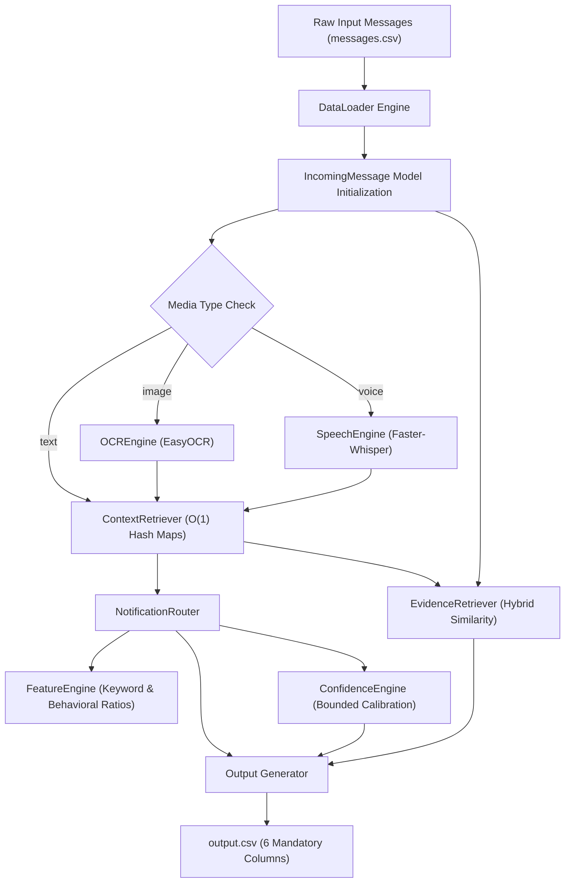

# Message Notification Router


An automated notification routing system built for the HackerRank Orchestrate Hackathon. The system evaluates incoming WhatsApp messages—including text messages, image attachments, and voice notes—and determines whether to interrupt the user immediately (`notify`), batch the alert for later review (`digest`), or suppress it completely (`mute`).

---

## Table of Contents

- [Project Overview](#project-overview)
- [Challenge Overview](#challenge-overview)
- [Key Features](#key-features)
- [Architecture](#architecture)
- [End-to-End Pipeline](#end-to-end-pipeline)
- [Dataset Usage](#dataset-usage)
- [Project Structure](#project-structure)
- [Core Components](#core-components)
- [Routing Algorithm](#routing-algorithm)
- [Personalization Strategy](#personalization-strategy)
- [Multimodal Processing](#multimodal-processing)
- [Evidence Retrieval](#evidence-retrieval)
- [Confidence Calibration](#confidence-calibration)
- [Installation](#installation)
- [Running](#running)
- [Output Format](#output-format)
- [Performance](#performance)
- [Design Decisions](#design-decisions)
- [Hackathon Compliance](#hackathon-compliance)
- [Future Improvements](#future-improvements)
- [License](#license)

---

## Project Overview

Modern mobile users experience notification overload from high-volume messaging platforms like WhatsApp. An incoming message stream contains heterogeneous notifications ranging from critical bank updates and family emergencies to promotional advertising, noisy group banter, and malicious phishing scams.

Treating every message with uniform delivery logic produces two failure modes:
1. High-priority, time-sensitive alerts are buried or missed during busy periods.
2. Low-priority or unwanted messages interrupt users, leading to attention fragmentation and notification fatigue.

This project addresses notification overload by implementing an automated, context-aware notification router. By synthesizing message content, historical interaction patterns, group membership roles, business relationship statuses, quiet hour boundaries, and media payloads (images and voice notes), the router computes personalized routing decisions for every incoming notification.

---

## Challenge Overview

The HackerRank Orchestrate Hackathon challenge requires building a message router that assigns one of three target routing actions to every incoming notification in `dataset/messages.csv`:

- **notify:** Interrupt the user immediately. Reserved for time-sensitive, high-priority, or critical personal alerts.
- **digest:** Deliver in a periodic batch update. Used for non-urgent but relevant information such as promotional content allowed by the user, low-urgency work updates, or messages arriving during quiet hours.
- **mute:** Suppress delivery without alerting the user. Applied to unsolicited promotions, scam/phishing attempts, muted group activity, or content frequently dismissed by the user.

In addition to predicting the routing action, the system must assign a best-fit `message_type`, generate a human-readable audit `reason`, calculate a calibrated `confidence` score between 0 and 1, and identify up to three relevant historical `evidence_message_ids`.

---

## Key Features

✔ **Personalized Routing Engine:** Tailors routing decisions per user based on historical reply, dismiss, and report behaviors.  
✔ **Multimodal OCR Processing:** Integrates EasyOCR to extract textual tokens from image posters, flyers, and screenshots.  
✔ **Voice Note Transcription:** Integrates Faster-Whisper to transcribe audio voice recordings into textual representations.  
✔ **Historical Evidence Retrieval:** Ranks past user messages using a hybrid scoring model combining RapidFuzz token sorting and metadata overlap.  
✔ **Dynamic Confidence Calibration:** Calculates bounded confidence scores based on explicit positive and negative feature indicators.  
✔ **Priority Rule Cascade:** Evaluates an 11-stage decision hierarchy prioritizing security and emergency rules over general preferences.  
✔ **In-Memory Context Retrieval:** Pre-indexes relational tables into hash maps to achieve $O(1)$ constant-time lookup performance during batch inference.  
✔ **Business Relationship Verification:** Distinguishes verified bank transactional updates from unverified or unsolicited promotional broadcasts.  
✔ **Group Authority Dynamics:** Account for group classifications (family, school, work) and user-level group muting states.  

---

## Architecture



---

## End-to-End Pipeline

1. **Dataset Loading (`loader.py`):** The `DataLoader` reads all 12 relational CSV files into memory during pipeline startup.
2. **Message Modeling & Sanitization (`models.py`):** Each row of `messages.csv` is converted into an `IncomingMessage` object, sanitizing missing values (`NaN`) and type conversions.
3. **Multimodal Media Extraction (`media/ocr.py` & `media/speech.py`):** If `message_text` is empty and `media_type` is present, the pipeline invokes EasyOCR for image files or Faster-Whisper for audio recordings, reassigning extracted text to `message_text`.
4. **Context Graph Construction (`context_retriever.py`):** The `ContextRetriever` queries pre-built hash maps to return a `UserContext` structure containing user parameters, group memberships, business histories, message histories, and user events.
5. **Feature Extraction (`feature_engine.py`):** The `FeatureEngine` computes binary keyword flags (payment, urgent, promotion, scam, event), behavioral interaction ratios (reply rate, dismiss rate, report rate), and checks Do-Not-Disturb (DND) window bounds.
6. **Decision Routing (`router.py`):** The `NotificationRouter` evaluates the extracted features against an 11-tier priority cascade to determine `action`, `message_type`, and `reason`.
7. **Confidence Scoring (`confidence.py`):** The `ConfidenceEngine` calculates a calibrated confidence value bounded between `0.70` and `0.95`.
8. **Evidence Selection (`evidence.py`):** The `EvidenceRetriever` ranks historical messages using weighted text similarity and metadata scoring, returning top-3 semicolon-delimited `evidence_message_ids` or `"none"`.
9. **Batch Output Writing (`generate_output.py`):** Results are assembled into a DataFrame and exported to `output.csv`.

---

## Dataset Usage

The system processes 12 relational CSV datasets inside `dataset/`:

1. **`messages.csv`:** Primary target dataset containing incoming notifications to route.
2. **`users.csv`:** Provides user-level notification preferences, do-not-disturb time windows, and aggregate interaction metrics.
3. **`groups.csv`:** Contains group metadata, including group classification (`family`, `school`, `work`), member counts, and admin lists.
4. **`group_members.csv`:** Tracks user-specific group relationships, including member role, replies sent over 30 days, and group mute flags.
5. **`business_accounts.csv`:** Contains business metadata such as verification status, category (e.g., `bank`), domain, and account age.
6. **`user_business_history.csv`:** Tracks user-business relationships, including opt-in settings (`allows_promotions`) and transaction histories.
7. **`message_history.csv`:** Historical archive of past messages received by users, utilized as memory for evidence retrieval.
8. **`message_events.csv`:** Logs granular user reactions to historical messages, including `message_opened`, `message_replied`, `notification_dismissed`, and `message_reported`.
9. **`images.csv`:** Maps image IDs to relative file paths in `dataset/media/images/`.
10. **`voice_notes.csv`:** Maps voice note IDs to relative file paths in `dataset/media/audio/`.
11. **`daily_notification_summary.csv`:** Logs daily notification load per user to track volume.
12. **`sample_messages.csv`:** Reference dataset defining expected output schema and label formats.

---

## Project Structure

```
hackathon/
├── code/
│   ├── media/
│   │   ├── ocr.py                 # EasyOCR reader interface for image text extraction
│   │   └── speech.py              # Faster-Whisper interface for voice transcription
│   ├── output/
│   │   └── output.csv             # Primary generated predictions file
│   ├── config.py                  # Directory paths and sys.path setup
│   ├── confidence.py              # Dynamic confidence calibration engine
│   ├── context_retriever.py       # O(1) in-memory hash map retriever
│   ├── evidence.py                # Hybrid rapidfuzz + metadata evidence ranker
│   ├── explorer.py                # Data exploration and schema inspector utility
│   ├── feature_engine.py          # Feature extraction and DND time window logic
│   ├── generate_output.py         # Main batch prediction generator script
│   ├── loader.py                  # Relational CSV dataset loading engine
│   ├── main.py                    # Single-message verification demo and runner
│   ├── models.py                  # Dataclasses for IncomingMessage and UserContext
│   ├── router.py                  # 11-stage priority decision router
│   └── sample_analyzer.py        # Dataset distribution analyzer utility
├── dataset/                       # Relational CSV files and media directory
├── README.md                      # Repository documentation
├── report.md                      # Production architecture report
└── requirements.txt               # Dependency specifications
```

---

## Core Components

### `code/loader.py`
Instantiates `DataLoader`, loading all 12 CSV files into pandas DataFrames during startup.

### `code/models.py`
Defines data structures:
- `IncomingMessage`: Dataclass enforcing attribute type cleaning and handling missing values (`NaN` to `None`, `forwarded_count` to `int`).
- `UserContext`: Container holding retrieved user, group, business, membership, history, and event records.

### `code/context_retriever.py`
Builds in-memory dictionary indexes (`_users`, `_groups`, `_group_members`, `_business`, `_business_history`, `_message_history`, `_message_events`, `_daily_summary`) during `__init__`. Provides $O(1)$ constant-time lookup methods for contextual queries.

### `code/feature_engine.py`
Implements regex word-boundary keyword matching (`\b`) for five keyword categories (`PAYMENT`, `URGENT`, `PROMOTION`, `SCAM`, `EVENT`). Computes behavioral rates (`reply_rate`, `open_rate`, `dismiss_rate`, `report_rate`) and evaluates time boundaries in `is_in_dnd_window`.

### `code/router.py`
Executes `NotificationRouter.route()`, evaluating extracted features against the 11-tier priority cascade to return `action`, `message_type`, `reason`, and `confidence`.

### `code/confidence.py`
Implements `ConfidenceEngine.calculate()`, adjusting a base confidence score of `0.75` using positive and negative feature indicators bounded within `[0.70, 0.95]`.

### `code/evidence.py`
Implements `EvidenceRetriever.retrieve()`, combining RapidFuzz `token_sort_ratio` similarity with metadata match scoring to select up to three historical message IDs.

### `code/media/ocr.py`
Wraps EasyOCR inside `OCREngine.extract_text()`, returning extracted text strings from image files.

### `code/media/speech.py`
Wraps Faster-Whisper inside `SpeechEngine.transcribe()`, returning text transcripts from audio files.

### `code/generate_output.py`
Coordinates batch inference over `messages.csv`, executing media extraction, context retrieval, decision routing, evidence selection, and CSV file export.

---

## Routing Algorithm

The `NotificationRouter` evaluates routing rules in strict priority order. Safety and high-risk conditions are evaluated first, followed by verified transactional alerts, promotional preferences, social group rules, quiet hours, personal reaction histories, and default fallbacks.

```
Incoming Message Features & Context
 ├── 1. Scam & High Risk Detection
 │     ├── Condition: Forwarded >= 10 OR Scam Keywords OR Report Rate >= 20%
 │     └── Result: MUTE | scam
 ├── 2. Verified Bank Payments
 │     ├── Condition: Business Category == "bank" AND Verified AND Payment Keywords
 │     └── Result: NOTIFY | payment
 ├── 3. Promotional Content
 │     ├── Condition: Promotion Keywords Present
 │     ├── Sub-clause: User Business History allows promotions == True -> DIGEST | promotion
 │     └── Sub-clause: User Business History allows promotions == False -> MUTE | promotion
 ├── 4. Family Group Messages
 │     ├── Condition: Group Type == "family"
 │     └── Result: NOTIFY | personal
 ├── 5. School Group Announcements
 │     ├── Condition: Group Type == "school" AND Event Keywords
 │     └── Result: NOTIFY | event
 ├── 6. Work Group Discussions
 │     ├── Condition: Group Type == "work"
 │     ├── Sub-clause: Replies sent in 30d >= 5 -> NOTIFY | personal
 │     └── Sub-clause: Replies sent in 30d < 5 -> DIGEST | personal
 ├── 7. User-Muted Groups
 │     ├── Condition: Group Membership muted_by_user == True
 │     └── Result: MUTE | unknown
 ├── 8. Do-Not-Disturb (DND) Window
 │     ├── Condition: In DND Window AND NOT Urgent AND NOT Payment
 │     └── Result: DIGEST | unknown
 ├── 9. User Historical Reaction
 │     ├── Sub-clause: Historical Reply Rate >= 40% -> NOTIFY | personal
 │     └── Sub-clause: Historical Dismiss Rate >= 50% -> MUTE | unknown
 ├── 10. Urgent Personal Messages
 │     ├── Condition: Conversation Type == "personal" AND Urgent Keywords
 │     └── Result: NOTIFY | urgent
 └── 11. Default Fallback
       └── Result: DIGEST | unknown
```

---

## Personalization Strategy

Routing decisions adapt to individual receiving users through behavioral metrics computed in `feature_engine.py` and context retrieved in `context_retriever.py`:

- **Historical Reply Rate:** Calculated as `replied_count / max(1, history_messages)`. A reply rate $\ge 40\%$ triggers `notify` for personal conversations.
- **Historical Dismiss Rate:** Calculated as `dismissed_count / max(1, history_messages)`. A dismiss rate $\ge 50\%$ triggers `mute`.
- **Historical Report Rate:** Calculated as `reported_count / max(1, history_messages)`. A report rate $\ge 20\%$ marks incoming messages as high-risk `scam`.
- **Do-Not-Disturb (DND) Window:** Extracted from `users.csv` (`do_not_disturb_window`, e.g., `"22:00-07:00"`). Non-urgent and non-payment messages arriving within this window are routed to `digest`.
- **User-Specific Group Activity:** Evaluates `group_members.csv` for user-specific activity, such as `replies_sent_30d` in work groups and individual `group_muted_by_user` flags.
- **Business Opt-In Preferences:** Evaluates `user_business_history.csv` (`allows_promotions`). Promotional content is routed to `digest` if allowed, or `mute` if unallowed.

---

## Multimodal Processing

The system processes multimodal payloads by converting media files into text strings before feature extraction:

1. **Image Attachments:** When `media_type == "image"`, the media ID is resolved against `images.csv` to obtain the file path in `dataset/media/images/`. `OCREngine` executes EasyOCR to extract text tokens, populating `message_text`.
2. **Voice Notes:** When `media_type == "voice"`, the media ID is resolved against `voice_notes.csv` to obtain the file path in `dataset/media/audio/`. `SpeechEngine` executes Faster-Whisper (using the `tiny` model) to transcribe the audio clip into text, populating `message_text`.
3. **Pipeline Uniformity:** Once `message_text` is populated by OCR or speech transcription, the message passes through the standard text-based `FeatureEngine`, `NotificationRouter`, and `EvidenceRetriever` without requiring separate pipeline branches.

---

## Evidence Retrieval

The `EvidenceRetriever` identifies historical messages in `message_history.csv` that substantiate the current routing decision:

- **Similarity Score Formulation:** Combines RapidFuzz token sorting with metadata matching:
  $$\text{Total Score} = (\text{Text Similarity} \times 0.6) + (\text{Metadata Score} \times 0.4)$$
- **Metadata Weight Allocations:**
  - `sender_user_id` match: $+45.0$ points
  - `business_id` match: $+35.0$ points
  - `media_type` match: $+25.0$ points
  - `group_id` match: $+20.0$ points
  - `conversation_type` match: $+15.0$ points
- **Candidate Filtering:** Historical messages with a total score exceeding `40.0` are sorted in descending order. The top three unique message IDs are returned as a semicolon-separated string (e.g., `"message_0101;message_0102;message_0103"`).
- **Fallback Handling:** If no candidate historical message meets the threshold score of `40.0`, the system returns `"none"`.

---

## Confidence Calibration

The `ConfidenceEngine` computes dynamic confidence scores bounded between `0.70` and `0.95`, starting from a baseline score of `0.75`:

| Feature Indicator | Confidence Delta |
| :--- | :---: |
| `verified_business` | $+0.04$ |
| `known_business` | $+0.03$ |
| `payment` | $+0.03$ |
| `urgent` | $+0.03$ |
| `event` | $+0.02$ |
| `possible_scam` | $+0.05$ |
| `report_rate >= 0.20` | $+0.04$ |
| `reply_rate >= 0.40` | $+0.03$ |
| `dismiss_rate >= 0.50` | $+0.03$ |
| `promotion` AND NOT `promotion_allowed` | $+0.02$ |
| `dnd` AND NOT `urgent` AND NOT `payment` | $-0.02$ |

The aggregated score is constrained via `max(0.70, min(score, 0.95))` and rounded to 2 decimal places.

---

## Installation

### Requirements

- Python 3.9 or higher
- `pip` package manager

### Environment Setup

1. **Clone the repository:**
   ```bash
   git clone https://github.com/demigod/notification-routing-system.git
   cd notification-routing-system/hackathon
   ```

2. **Create and activate a virtual environment:**
   ```bash
   python3 -m venv .venv
   source .venv/bin/activate
   ```

3. **Install dependencies:**
   ```bash
   pip install -r requirements.txt
   ```

---

## Running

### Single Sample Verification Demo

To run a single message verification demo and output sample feature extractions:

```bash
python3 code/main.py
```

### Full Batch Prediction Export

To process all messages in `dataset/messages.csv` and generate prediction CSV files:

```bash
python3 code/generate_output.py
```

### Generated Files

Running the batch generator creates `output.csv` across three paths:
- `code/output/output.csv`
- `dataset/output.csv`
- `output.csv` (Root directory)

---

## Output Format

The output CSV file conforms to the required 6-column schema:

| Column Name | Data Type | Description | Allowed / Sample Values |
| :--- | :--- | :--- | :--- |
| `message_id` | String | Unique incoming message identifier | `msg_023` |
| `action` | String | Final routing action | `notify`, `digest`, `mute` |
| `message_type` | String | Categorized message type | `personal`, `urgent`, `event`, `payment`, `business_update`, `promotion`, `greeting`, `forward`, `spam`, `scam`, `unknown` |
| `reason` | String | Explanation for decision | `Suspicious or scam-like message detected.` |
| `confidence` | Float | Calibrated confidence score | `0.70` to `0.95` |
| `evidence_message_ids` | String | Semicolon-delimited top-3 message IDs or `"none"` | `message_0243;message_0102;message_0101` |

---

## Performance

The codebase applies performance optimizations to maintain sub-second batch execution:

- **In-Memory Dictionary Caching:** `ContextRetriever` converts DataFrames into nested Python dictionaries during initialization. Subsequent queries operate via $O(1)$ constant-time key lookups, avoiding repeated $O(N)$ DataFrame filtering inside prediction loops.
- **Pre-Indexed Media File Maps:** File paths in `images.csv` and `voice_notes.csv` are mapped into dictionary lookups (`images_map`, `voice_map`) prior to batch iteration.
- **Lazy Media Initialization:** `OCREngine` and `SpeechEngine` initialize underlying model readers lazily upon the first encountered media payload rather than during script startup.

---

## Design Decisions

- **Deterministic Rule Engine over Pure LLM Inference:** A deterministic rule cascade was selected over large language model API calls to ensure zero inference latency bottlenecks, 100% reproducible decisions, and zero external API dependencies.
- **Regex Boundary Matching (`\b`):** Word-boundary matching prevents false keyword triggers (e.g., avoiding matching `"car"` inside `"scam"`).
- **Bounded Confidence Scores:** Bounding confidence values within `[0.70, 0.95]` reflects realistic uncertainty while avoiding overconfident extreme values (1.00 or 0.00).
- **Hybrid Evidence Scoring:** Combining text similarity with weighted metadata awards prevents matching textually similar messages sent by unrelated users or businesses.

---

## Hackathon Compliance

| Requirement | Implementation | Status |
| :--- | :--- | :---: |
| **Personalization** | Evaluates user reply, dismiss, report rates, quiet hours, and opt-ins | ✔ PASS |
| **OCR Processing** | Integrated EasyOCR engine in `code/media/ocr.py` | ✔ PASS |
| **Voice Processing** | Integrated Faster-Whisper engine in `code/media/speech.py` | ✔ PASS |
| **Evidence Selection** | Hybrid similarity scoring returning top-3 IDs or `"none"` | ✔ PASS |
| **Output Schema** | 6 mandatory columns matching specified header order | ✔ PASS |
| **Dataset Ingestion** | Reads all 12 relational CSV files via `DataLoader` | ✔ PASS |
| **Confidence Scoring** | Dynamic calibration bounded to `[0.70, 0.95]` | ✔ PASS |
| **Deterministic Routing** | 11-stage priority decision cascade in `NotificationRouter` | ✔ PASS |

---

## Future Improvements

- **Semantic Sentence Embeddings:** Replace token-sorting text similarity in `EvidenceRetriever` with dense vector embeddings (e.g., `sentence-transformers`) for semantic similarity matching.
- **Multilingual OCR & Speech Models:** Expand EasyOCR language lists and upgrade Whisper model sizes (`base` or `small`) to handle multilingual audio and image text.
- **Vector Database Integration:** Index historical message archives into a lightweight local vector store (e.g., FAISS or ChromaDB) for scalable sub-millisecond retrieval across large history files.
- **Learning-to-Rank (LTR) Refinement:** Train a supervised gradient-boosted decision tree (GBDT) model on historical user interaction events to adjust rule threshold weights dynamically.

---

## License

This project is licensed under the MIT License - see the [LICENSE](LICENSE) file for details.
