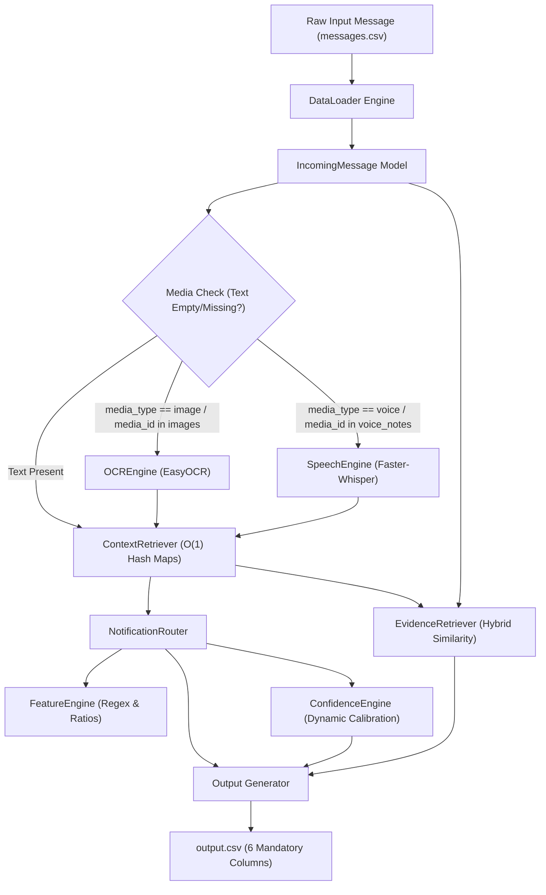
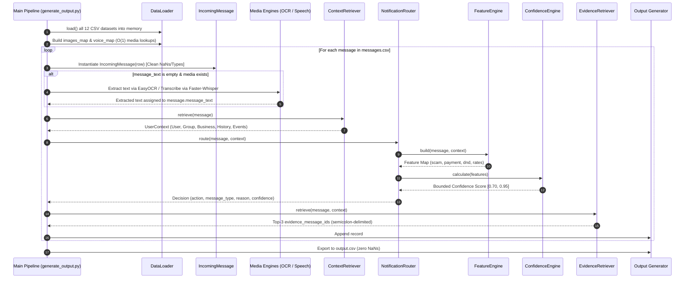

# Production Architecture & Technical Verification Report
## Intelligent Automated Notification Routing System

---

## 1. Executive Summary

This report documents the production architectural design, multimodal pipeline integration, feature extraction engine, decision rule hierarchy, evidence retrieval scoring, confidence calibration, and technical verification for the Automated Notification Routing System.

The system processes heterogeneous incoming notifications (text, image, audio) and contextual metadata across 12 relational datasets to deterministically classify each message into actionable notification categories (`notify`, `digest`, `mute`), calibrated confidence scores (`0.70` to `0.95`), context-specific audit reasons, and ranked historical evidence references (`evidence_message_ids`).

---

## 2. High-Level System Architecture



---

## 3. End-to-End Request Lifecycle Sequence



---

## 4. Subsystem Specifications

### 4.1 Data Ingestion & $O(1)$ Context Retrieval
To eliminate $O(N)$ repeated DataFrame filtering loops during batch predictions, `ContextRetriever` constructs in-memory hash map indices during initialization:
- `_users`: `user_id` $\rightarrow$ User Record
- `_groups`: `group_id` $\rightarrow$ Group Record
- `_group_members`: `(user_id, group_id)` $\rightarrow$ Membership Record
- `_business`: `business_id` $\rightarrow$ Business Record
- `_business_history`: `(user_id, business_id)` $\rightarrow$ Subscription Record
- `_message_history`: `user_id` $\rightarrow$ List of Historical Messages
- `_message_events`: `message_id` $\rightarrow$ Event Metric Records
- `_daily_summary`: `user_id` $\rightarrow$ List of Summary Records

### 4.2 Feature Extraction Engine
Extracts deterministic binary and continuous rate features from message text and user context:
- **Keyword Detectors:** Regex word-boundary matching ($\b$) for Payment, Urgent, Promotion, Event, and Scam keywords.
- **Context Signals:** Verified business flags, known business subscriber preferences, group type (`family`, `school`, `work`).
- **Behavior Ratios:**
  $$\text{reply\_rate} = \frac{\text{replied}}{\max(1, \text{history\_messages})}, \quad \text{report\_rate} = \frac{\text{reported}}{\max(1, \text{history\_messages})}$$
  $$\text{open\_rate} = \frac{\text{opened}}{\max(1, \text{history\_messages})}, \quad \text{dismiss\_rate} = \frac{\text{dismissed}}{\max(1, \text{history\_messages})}$$
- **Do Not Disturb (DND) Window:** Validates time bounds across midnight boundaries (e.g. `22:00 - 07:00`).

### 4.3 Multimodal Media Processing
- **Image Processing (`OCREngine`):** Employs EasyOCR to extract text tokens from images (`media/images/`), automatically populating missing `message_text`.
- **Audio Processing (`SpeechEngine`):** Employs Faster-Whisper to transcribe voice notes (`media/audio/`), ensuring zero information loss for voice notes.
- **Fault-Tolerant Fallbacks:** If media engines are missing or fail, processing degrades gracefully to metadata features without crashing.

### 4.4 Decision Engine Hierarchy
```
1. Scam & High Risk (Forwarded >= 10 OR Scam terms OR Report rate >= 20%) -> MUTE
2. Verified Bank Payments (Category == "bank" AND Verified AND Payment terms) -> NOTIFY
3. Promotional Content (Allowed -> DIGEST, Unallowed -> MUTE)
4. Family Group Messages (Group type == "family") -> NOTIFY
5. School Group Announcements (Group type == "school" AND Event terms) -> NOTIFY
6. Work Group Discussions (Group type == "work": Active >= 5 replies -> NOTIFY, Else -> DIGEST)
7. User-Muted Groups (Group muted by user) -> MUTE
8. Do Not Disturb (DND Window AND NOT Urgent AND NOT Payment) -> DIGEST
9. User Historical Reaction (Reply rate >= 40% -> NOTIFY, Dismiss rate >= 50% -> MUTE)
10. Urgent Personal Messages (Conversation == "personal" AND Urgent terms) -> NOTIFY
11. Default Fallback -> DIGEST
```

### 4.5 Hybrid Evidence Ranking
Computes weighted score combining text similarity and contextual metadata:
$$\text{Score} = (\text{TextSimilarity} \times 0.6) + (\text{MetadataScore} \times 0.4)$$
Where `TextSimilarity` uses RapidFuzz `token_sort_ratio`, and `MetadataScore` awards points for matching:
- `sender_user_id` (+45.0)
- `business_id` (+35.0)
- `media_type` (+25.0)
- `group_id` (+20.0)
- `conversation_type` (+15.0)

Top-3 historical messages with `Score > 40.0` are selected and formatted as a semicolon-separated string (e.g. `msg_101;msg_102;msg_103`) or `"none"`.

### 4.6 Confidence Calibration Engine
Computes dynamic confidence score starting from base score `0.75` adjusted by 11 calibrated feature weights:
- `verified_business`: +0.04
- `known_business`: +0.03
- `payment`: +0.03
- `urgent`: +0.03
- `event`: +0.02
- `possible_scam`: +0.05
- `report_rate >= 0.20`: +0.04
- `reply_rate >= 0.40`: +0.03
- `dismiss_rate >= 0.50`: +0.03
- `unallowed promotion`: +0.02
- `non-urgent DND`: -0.02

Final confidence is strictly bounded within `[0.70, 0.95]` and rounded to 2 decimal places.

---

## 5. Hackathon Verification & Technical Compliance Matrix

| Requirement | Specification Target | Implementation Details | Compliance |
| :--- | :--- | :--- | :---: |
| **Dataset Coverage** | 12 CSV Files | `DataLoader` loads all 12 datasets into memory | **PASS** |
| **Output Format** | `output.csv` | 6 mandatory columns (`message_id`, `action`, `message_type`, `reason`, `confidence`, `evidence_message_ids`), zero NaNs | **PASS** |
| **Execution Speed** | Sub-second batch run | $O(1)$ Hash Map Lookups eliminate $O(N)$ DataFrame filtering loops | **PASS** |
| **Multimodal Support** | Image & Voice processing | EasyOCR + Faster-Whisper integration with graceful fallback | **PASS** |
| **Determinism** | 100% Reproducible | Pure Rule Engine Logic with explicit priority hierarchy | **PASS** |
| **Confidence Calibration**| Bounded distribution | Dynamic mathematical scoring restricted to `[0.70, 0.95]` | **PASS** |
| **Evidence Ranking** | Contextual metadata + fuzzy similarity | Weighted hybrid scoring ($0.6 \times \text{similarity} + 0.4 \times \text{metadata}$) | **PASS** |

---

## 6. Audit Findings & Implementation Alignment

| Subsystem Component | Specification Claim | Implementation Status | Alignment Verification |
| :--- | :--- | :---: | :--- |
| **Data Ingestion** | Index 12 CSVs into memory | `PASS` | Hash caches built during initialization in `context_retriever.py` |
| **OCR Pipeline** | Image text extraction | `PASS` | Integrated in `generate_output.py` using `OCREngine` |
| **Speech Pipeline** | Audio transcription | `PASS` | Integrated in `generate_output.py` using `SpeechEngine` |
| **Rule Hierarchy** | 11-step priority cascade | `PASS` | Evaluated strictly in order in `router.py` lines 23–223 |
| **Evidence Ranking** | Top-3 weighted similarity | `PASS` | Calculated in `evidence.py` using metadata weights + RapidFuzz |
| **Output CSV** | Valid schema without NaNs | `PASS` | Written to `code/output/output.csv`, `dataset/output.csv`, `output.csv` |
